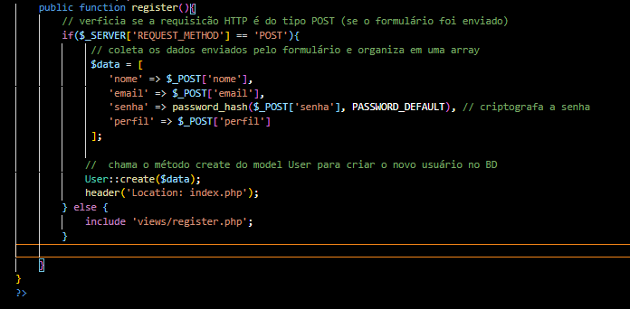

# Sistema de Cadastro de Login 

# INDÍCE
[Cadastro de Login - Introdução](#cadadastro-de-login---introdu%C3%A7%C3%A3o) 
[Tecnologias utilizadas](#tecnologias-utilizadas)  
[Funcionalidades](#funcionalidades)  
[Considerações finais](#considera%C3%A7%C3%B5es-finais)   

# Sistema de Cadastro de Login - Introdução
 

## Tecnologias utilizadas
Neste projetos tivemos o uso de:
* HTML 5 
* CSS 3
* PHP
* XAMPP
* MYSQL
* GIT 
* GITHUB

## Funcionalidades
Para elaborar o site, construímos três sessões para trabalhar em recursos especíificos que fariam o site funcionar da forma que deveria. Divimos essas sessões como: 

### CONTROLLERS
  
Os arquivos **CONTROLLERS** - ou controladores, esses arquivos servem para a manipulção de dados e criação de novos usuários.   

#### AuthController 
 
O código acima lida com o processo de login de um usuário. Verifica se a requisição **HTTP** é do tipo **POST**, ou seja, se o formulário foi enviado. Utilizando o recurso **findByEmail** ele verifica se a senha e o email preenchidos no formulário são condizentes com os que foram cadastrado e, se tudo estiver correto, inicia uma sessão e redireciona o usuário. Caso contrário, exibe uma mensagem de erro.

#### UserController
 
As linhas de código acima tratam o registro de novos usuários. Se o formulário for enviado, ele coleta os dados e os organiza uma array, em seguida ele criptografa a senha e no final chama o método **create** do model **User** para criar o novo usuário no BD.

#### DashboardController
 
No momento da documentação deste arquivo, ele se encontra sem alterações, ou seja, vazio.  

### MODELS
 
Os arquivos **MODELS** - ou modelos - são responsáveis pela conexão com o banco de dados. 

####  Database.php
 
O código acima é responsável por gerenciar a conexão com o banco de dados, definindo uma classe database. A conexão usa o driver Mysql **(mysql:)** e as informações de host e BD para criar uma instância para se conectar ao BD. Ao final ele define o modo de erro exceções, facilitando a de puração e tratamento do erro.  

#### User.php
 
O código possui uma função para encontrar um usuário pelo e-mail de cadastro, em seguida eme obtém conexão com o banco de dados para guard-la em uma variável retornando os dados do usuário encontrado como um array associativo. Em seguida, criamos a função que cria o usuário na base de dados e localiza o usuário pelo id.  

### VIEWS
 
Os arquivos **VIEWS** - ou arquivos de vizualização, são os responsáveis por aquilo que vai ser apresentado ao usuário, ou seja, a "front-end" do site.

#### Login.php
 
Front-end do o que o usuário vai vizualizar para realizar seu login.

#### Register.php
 
Front-end do que o usuário vai vizalizar para realizar seu cadastro, tendo três opções de tipos de usuários: 
* ADMIN
* GESTOR
* COLABORADOR 

### DATABASE
 
Esse código SQL cria um banco de dados e uma tabela para armazenar informações de usuários.  

### ARQUIVO DE ROTA
 
Este código define a ação a ser executada com base no parâmetro action passado na URL. Se for **login**, ele chama o método de login, e o mesmo com o método **register**, se não for nenhum dos dois, o método de login é chamado por padrão.

## Considerações finais
Por enquanto o projeto ainda se encontra em desenvolvimento, logo, ele está incompleto e sujeito a alterações futuras.

Este projeto foi desenvolvido por <strong> Sarah Ozeto </strong>, com a orientação do professor Leonardo Rocha.  
