# INDÍCE
[Cadastro de Login - Introdução](#cadadastro-de-login---introdu%C3%A7%C3%A3o) 
[Tecnologias utilizadas](#tecnologias-utilizadas)  
[Considerações finais](#considera%C3%A7%C3%B5es-finais)   

# Sistema de Cadastro de Login - Introdução
 
Utilizando as tecnologias do PHP e Banco de dados (PhpMyAdmin) desenvolvemos um site de cadastro de novos usuários, na qual é possível se cadastrar com um dos três tipos de usuário: Administrador, Gestor ou Colaborador. O site possuí as funcionalidades de edição e deleção de usuário, que podem ser executadas apenas por um **administrador** ou **gestor**. Para construir o site, dividimos três sessões para trabalhar em recursos específicos. Dividimos essas sessões como: 

## CONTROLLERS
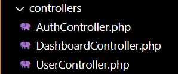  
Os arquivos do controller servem para a manipulaçao de dados e criação de novos usuários.  

#### AuthController 
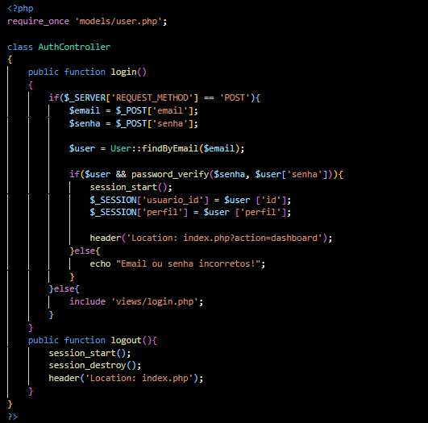 
O código acima lida com o processo de login de um usuário já cadastrado. Ele verifica se a requisição **HTTP** é do tipo **POST**, ou seja, se o formulário foi enviado e utiliza o recuros **findByEmail** verifica se a senha e o email preenchidos foram cadastrados, se houver sucesso na operação o usuário é redirecionado para a tela do dashboard. A função de **logout** apenas redireciona o usuário para a página de login utilizando de um **header**.

#### UserController
Este arquivo é responsável pelo registro de novos usuários, foi criados quatro funções públicas para realizarem tarefas distintas, sendo elas:  

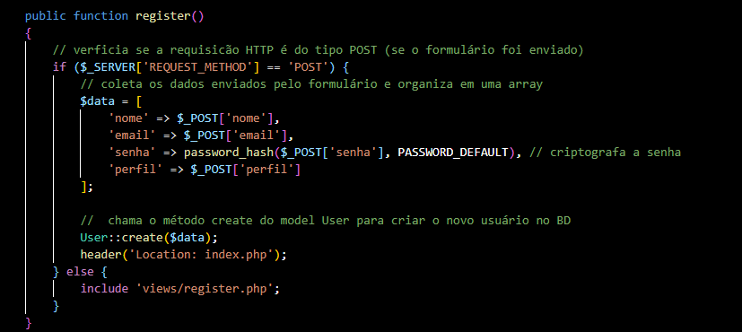 
Se a aquisição for do tipo **POST**, o código coleta os dados do formulário e os armazena em um array chamado **$data**, após isso ele criptografa a senha e insere um novo usuário ao banco de dados chamando o método **create** da classe **user**. ao final do cadastro o usuário é redireciona para a página de login usand um **header('Location:'). 

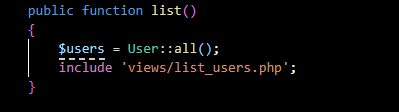 
Essa função recupera todos os usuários do banco de dados chamando o método **all** da classe **user**, que retorna para nós uma lista (array) dos usuários armazenados no banco de dados. Em seguida, o site redireciona o usuário para a página da lista. 

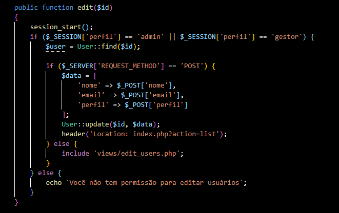 
O código reconhece que apenas os perfil de **admin** ou **gestor** tem a permissão de editar ou excluir um usuário, se o usuário não tiver permissão, o site exibe uma mensagem de erro, caso contrário, a função usa **User::find($id)** para buscar o usuário pelo id fornecido. Quando o formulário for enviado, o código coleta os dados e os armazena na array **$data**, em seguida o método **User::update** para atualizar o registro no banco com o ID. 

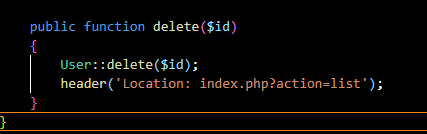 
O método **delete** da classe **user** é responsável por remover o registro do usuário correspondente no banco de dados com base no ID cadastrado, após a exclusão a função redireciona o navegador para uma página onde a lista está atualizada. 

#### DashboardController
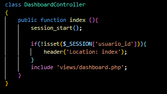 
O código define um classe chamada **DashboardController** para gerenciar o acesso ao painel do sistema, o dashboard, mas antes ele verifica se o usuário está autenticado, se não estiver, o usuário é redirecionado para a página de login.  

## MODELS
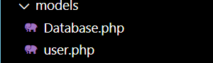 
Os arquivos de modelos são responsáveis pela conexão com o banco de dados. 

####  Database.php
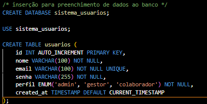 
O código define uma classe chamada **Database** para gerenciar a conexão com o banco de dados, ela utiliza o padrão **Singleton**. A variável **self::$instance** armazena a instância da conexão que é compartilhada por toda a classe, por ser estática, utiliza o método **GetConnection** para retornar a conexão com o banco de dados. 
Já a conexão é criada usando a estrutura **"$host, $db, $user, $password"**, na qual usamos para definir o tipo de banco de dados e o nome do banco.

#### User.php
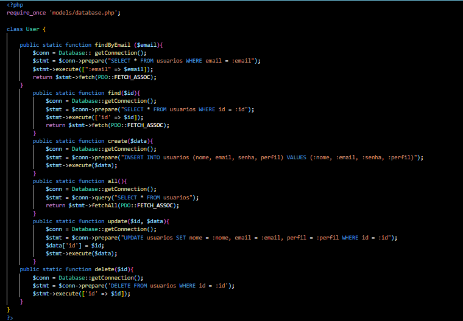 
O código possuí algumas funções para estabelecer uma conexão com o banco de dados **(Database::getConnection())** e encontrar o usuário pelo email de cadastro **(FindByEmail)**, em segiuda nós listamos todas as informações do usuário para exibir no dashboard e prepara a consulta SQL para atualização dos dados do usuário.

o código possui uma função para encontrar um usuário pelo email de cadastro, em seguida obtém conexão com o banco de dados para guarda-la em uma array. Em seguida, criamos a função que cria o usuário na base de dados e localiza o usuário pelo id permitindo buscar, criar, atualizar, listar e deletar usuário com a classe **User**.  

## VIEWS
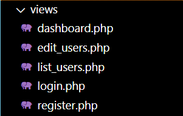 
Os arquivos de vizualização são os reponsáveis por aquilo que vai ser apresentado ao usuário, ou sej,a o "front-end" do site. 

#### Dashboard.php
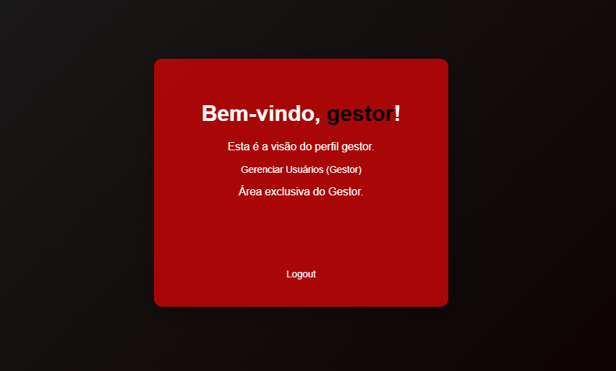 
Essa página personaliza o conteúdo exibido com base no perfil do usuário logado, permitindo que **admins** e **gestores** vejam links para gerenciamento de usuários enquanto colaboradores têm uma área mais restrita. Ela usa o **($_SESSION['perfil'])** para determinar o perfil.
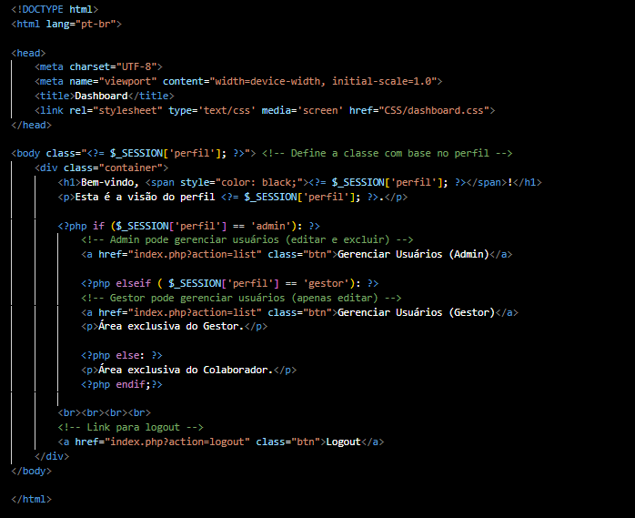 

#### EDITAR USUÁRIOS
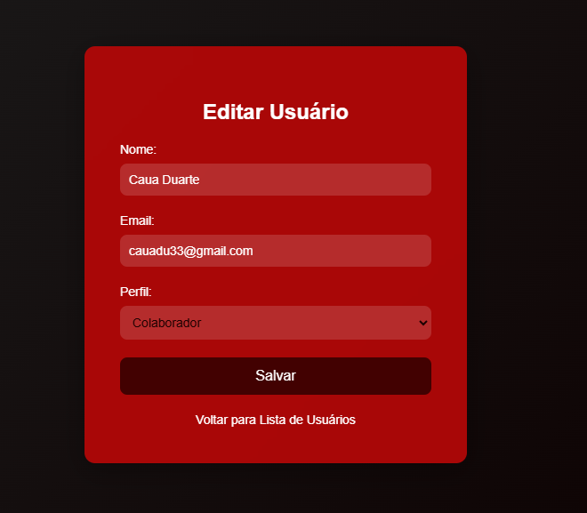 
Esse código exibe uma página HTML para editar os dados de um usuário especifico, o formulário é enviado para o **index.php** para processar e salvar as alterações no banco de dados. 
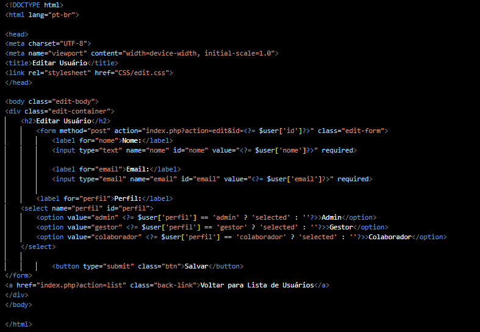 

#### LISTAR USUÁRIOS
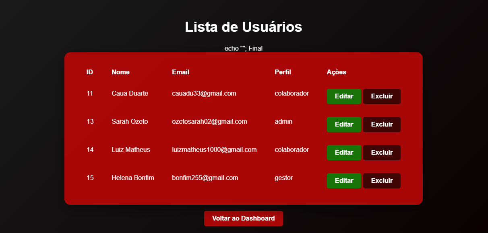 
Esse código exibe uma página HTML para exibir uma lista de usuário em uma tabela de HTML, com diferentes permissões de ação baseadas no perfil do usuário logado. Apenas o **admin** pode excluir um usuário, e um aviso de confirmação é exibido antes da exclusão. O layout e permissões são controlados de acordo com o perfil de cada usuário, conforme definido na sessão **($_SESSION['perfil']).**  
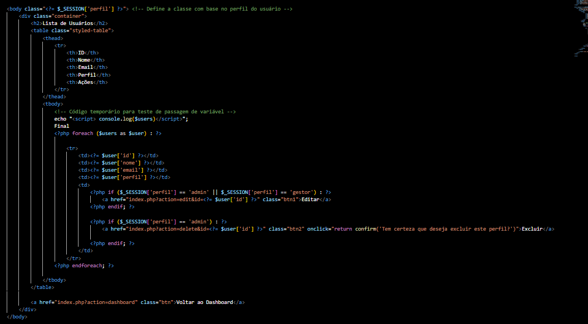 

## DATABASE
 
Esse código SQL cria um banco de dados e uma tabela para armazenar informações de usuários.  
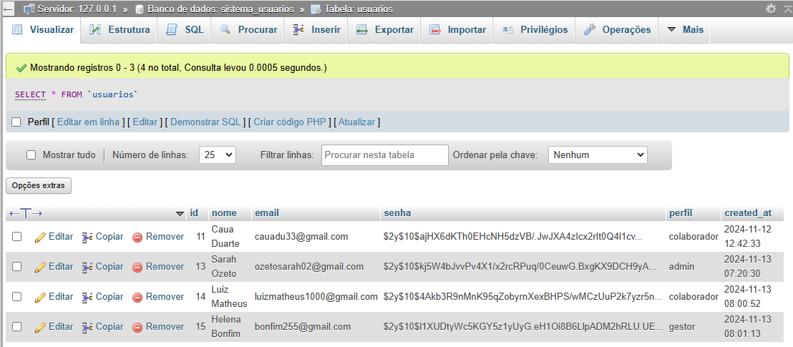 

## ARQUIVO DE ROTA
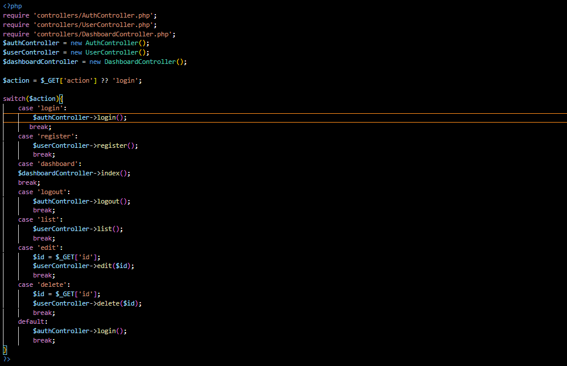 
Este código define a ação a ser executada com base no parâmetro action passado na URL. Se for **login**, ele chama o método de login, e o mesmo com o método **register**, se não for nenhum dos dois, o método de login é chamado por padrão.

## Tecnologias utilizadas
Neste projetos tivemos o uso de:
* HTML 5 
* CSS 3
* PHP
* XAMPP
* MYSQL
* PHPMYADMIN
* GIT 
* GITHUB

## Considerações finais
Este projet já foi finalizado, a versão que você está vizualizando é a versão final.

## AUTORES
 
Esse projeto foi desenvolvido por Sarah Ozeto, com a orientação do professo **Leonardo Rocha** e o auxílio dos colegas de sala **Nathan Oliveira** e **Caio Estevão.**
